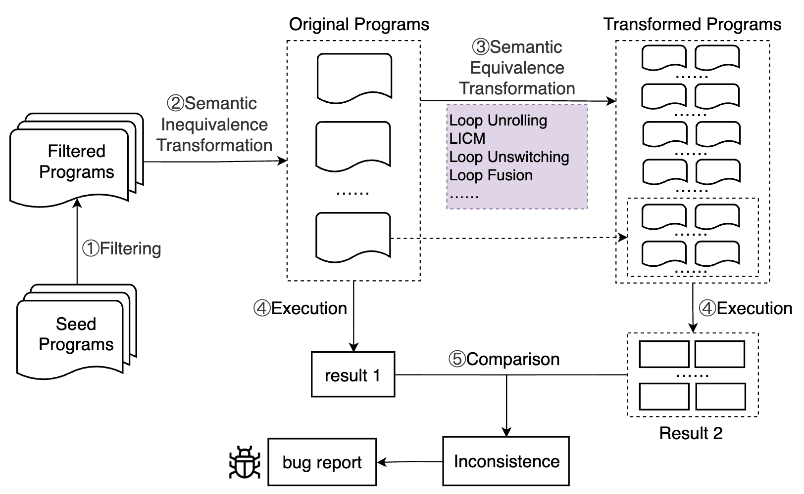

# Optimization Testing
Our approach leverages tailored code construction strategies to generate input programs that meet optimization conditions. Subsequently, it applies various compiler optimization transformations to produce semantically equivalent test programs. By comparing the outputs of the pre- and post-transformation programs, this method effectively identifies incorrect optimization bugs. The detailed process is illustrated in the figure below. 



By default, we uses Csmith to produce seed programs. 

# Structure of the project

```
Core operations is under the main folder:
|-- astinfo # The ast analysis implementation directory
|-- mutations # The tailored code genertion strategies and mutate implementation directory
|-- csmithgen # The seed program generation implementation directory using Csmith
| |-- SwarmGen.java  # Updating configurations of Csmith
|-- testcompareresults # The programs testing execution and their results comparison implementation directory
|-- objectoperation # The common operations targeted different datatype implemention directory
|-- common # The common information extraction functions implemention directory
|-- overall # The overall testing process execution implemention directory
| |-- Main.java  # The entrance of overall testing process
|-- processmemory # The process dealing and real-time memory check implemention directory
|-- sanitizer # The undefined behaviour filtering implemention directory
|-- utility # The java beans of overall testing process
```

# Usage

### Step 1: Install necessary packages

- Ubuntu >= 20
- Java >= 17
- Csmith (Please install it following [Csmith](https://github.com/csmith-project/csmith))
- CSMITH_HOME: After installing Csmith, please set the environment variable `CSMITH_HOME` to the installation path, with which we can locate `$CSMITH_HOME/include/csmith.h`.
- Clang >= 14
- Add file `libsigar-amd64-linux.so` into `/usr/lib` and `/usr/lib64`

### Step 2: Test clang ast analysis functionality

Assuming there is a program test.c:
```
#include <stdio.h>

int add(int a, int b) {
  return a + b;
}

void main() {
  int x = 3;
  int y = 4;
  printf("%d\n", add(x, y));
}
```

The command `clang -fsyntax-only -Xclang -ast-dump test.c -w -Xanalyzer -analyzer-disable-all-checking -I $CSMITH_HOME/include` is executed, and if the following output occurs, then there is no issue.
```
|-FunctionDecl 0x55f86a0e1450 <test.c:3:1, line:5:1> line:3:5 used add 'int (int, int)'
| |-ParmVarDecl 0x55f86a0e12f0 <col:9, col:13> col:13 used a 'int'
| |-ParmVarDecl 0x55f86a0e1370 <col:16, col:20> col:20 used b 'int'
| `-CompoundStmt 0x55f86a0e15a8 <col:23, line:5:1>
|   `-ReturnStmt 0x55f86a0e1598 <line:4:3, col:14>
|     `-BinaryOperator 0x55f86a0e1578 <col:10, col:14> 'int' '+'
|       |-ImplicitCastExpr 0x55f86a0e1548 <col:10> 'int' <LValueToRValue>
|       | `-DeclRefExpr 0x55f86a0e1508 <col:10> 'int' lvalue ParmVar 0x55f86a0e12f0 'a' 'int'
|       `-ImplicitCastExpr 0x55f86a0e1560 <col:14> 'int' <LValueToRValue>
|         `-DeclRefExpr 0x55f86a0e1528 <col:14> 'int' lvalue ParmVar 0x55f86a0e1370 'b' 'int'
`-FunctionDecl 0x55f86a0e1608 <line:7:1, line:11:1> line:7:6 main 'void ()'
  `-CompoundStmt 0x55f86a0e1a20 <col:13, line:11:1>
    |-DeclStmt 0x55f86a0e1750 <line:8:3, col:12>
    | `-VarDecl 0x55f86a0e16c8 <col:3, col:11> col:7 used x 'int' cinit
    |   `-IntegerLiteral 0x55f86a0e1730 <col:11> 'int' 3
    |-DeclStmt 0x55f86a0e1808 <line:9:3, col:12>
    | `-VarDecl 0x55f86a0e1780 <col:3, col:11> col:7 used y 'int' cinit
    |   `-IntegerLiteral 0x55f86a0e17e8 <col:11> 'int' 4
    `-CallExpr 0x55f86a0e19c0 <line:10:3, col:27> 'int'
      |-ImplicitCastExpr 0x55f86a0e19a8 <col:3> 'int (*)(const char *, ...)' <FunctionToPointerDecay>
      | `-DeclRefExpr 0x55f86a0e1820 <col:3> 'int (const char *, ...)' Function 0x55f86a0c9450 'printf' 'int (const char *, ...)'
      |-ImplicitCastExpr 0x55f86a0e1a08 <col:10> 'const char *' <NoOp>
      | `-ImplicitCastExpr 0x55f86a0e19f0 <col:10> 'char *' <ArrayToPointerDecay>
      |   `-StringLiteral 0x55f86a0e1840 <col:10> 'char[4]' lvalue "%d\n"
      `-CallExpr 0x55f86a0e1900 <col:18, col:26> 'int'
        |-ImplicitCastExpr 0x55f86a0e18e8 <col:18> 'int (*)(int, int)' <FunctionToPointerDecay>
        | `-DeclRefExpr 0x55f86a0e1860 <col:18> 'int (int, int)' Function 0x55f86a0e1450 'add' 'int (int, int)'
        |-ImplicitCastExpr 0x55f86a0e1930 <col:22> 'int' <LValueToRValue>
        | `-DeclRefExpr 0x55f86a0e1880 <col:22> 'int' lvalue Var 0x55f86a0e16c8 'x' 'int'
        `-ImplicitCastExpr 0x55f86a0e1948 <col:25> 'int' <LValueToRValue>
          `-DeclRefExpr 0x55f86a0e18a0 <col:25> 'int' lvalue Var 0x55f86a0e1780 'y' 'int'
```
### Step 3: Update the corresponding folder information
In the `/src/Overall/Main.java`, the string `swarmDir` is the absolute path of the folder that contains all seed programs generated using Csmith, while the String `muIndexPath` is the absolute path of the folder that includes all test programs (i.e., both the initial and transformed programs). Within the `muIndexPath`, structure of each subfolder is following:
```
|-- random 
| |-- block # Each block aligns a loop of the seed program.
| | |-- mutate # Each mutate includes an initial program, its transformed programs and some txt output files.
| | | |-- initial_program.c
| | | |-- initial_transformed.c
| | | |-- compiler_output.txt
| | | |-- compiler_sanitizer.txt
| | | |-- compiler_performance.txt

```
Finally, the programs with discrepancies are logged in the `gcc` and `llvm` folder respectively within the `muIndexPath` folder. 

In the `/src/Overall/Main.java`, you also need to modify the third argument in `OverallProcess overall = new OverallProcess(swarmDir, muIndexPath, "")`. The available options are: `fusion_samenumber`, `fusion_add`, `fusion_max`, `invariant`, `unswitching_compound`, `unrolling`.

If you want to change the Csmith generation configuration, you need to modify it in `SwarmGen.java`. Currently, we randomly select configurations for generation.

### Step 4: Run the project
Run the `Main.java` in the `/src/Overall`. 

# Find Bugs
We conduct a preliminary evaluation of this approach on GCC and LLVM, and have successfully detected five incorrect optimization bugs.

### Bug List

| ID  | Compiler | Issue           | Status   |
| --- | -------- | --------------- | -------- |
| 1   | GCC      | [GCC-113709](https://gcc.gnu.org/bugzilla/show_bug.cgi?id=113709) | Fixed     |
| 2   | GCC      | [GCC-113702](https://gcc.gnu.org/bugzilla/show_bug.cgi?id=113702) | Fixed     |
| 3   | GCC      | [GCC-113669](https://gcc.gnu.org/bugzilla/show_bug.cgi?id=113669) | Confirmed |
| 4   | LLVM     | [LLVM-75809](https://github.com/llvm/llvm-project/issues/75809)   | Confirmed |
| 5   | LLVM     | [LLVM-112880](https://github.com/llvm/llvm-project/issues/112880) | Confirmed |


